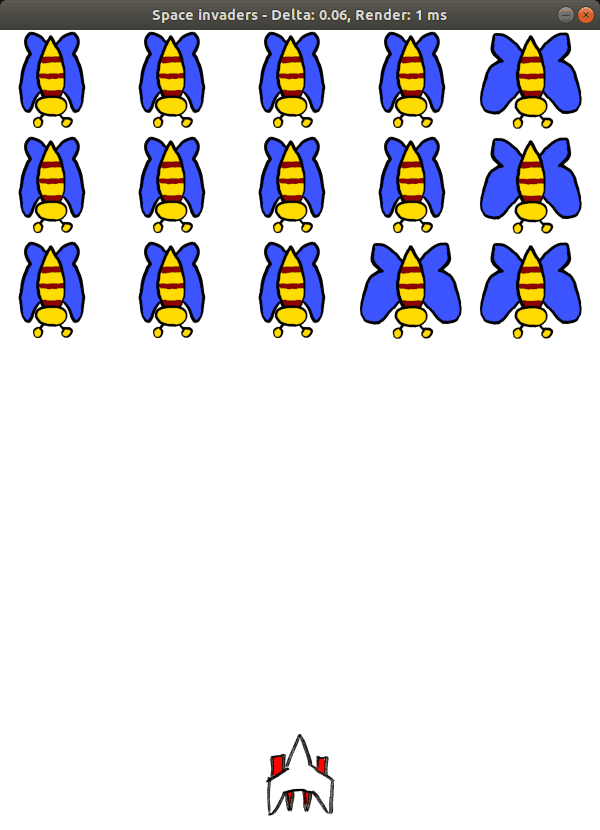

# Space-Invaders-ECS-Python

The goal of this simple Space Invaders game is to (1) learn how to do frame rate
independent physics and to (2) learn how to organize code according to the
[Entity-Component-System](https://en.wikipedia.org/wiki/Entity_component_system)
architectural pattern, favoring composition over inheritance.

The game requires Python 3.6.9 or higher.

## Getting started

    $ git clone https://github.com/ronnieholm/Space-Invaders-ECS-Python.git
    $ cd Space-Invaders-ECS-Python
    $ python3 -m venv venv
    $ source venv/bin/activate
    $ pip3 install -r requirements.txt

    # On Windows and Mac install pre-build libsdl2
    $ pip3 install pysdl2-dll

    $ python3 main.py
    $ deactivate

<!--
- Expclitly pip3 installed: PySDL2, pylint, mypy, rope, autopep8
- Record gif demo: byzanz-record --delay 5 --duration=10 --x=3540 --y=680 --width=600 --height=830 demo.gif
-->

## Profiling
    
    python3 -m profile -s cumtime main.py
             3792124 function calls (3791459 primitive calls) in 10.775 seconds
    
       Ordered by: cumulative time
    
       ncalls  tottime  percall  cumtime  percall filename:lineno(function)
         67/1    0.001    0.000   10.775   10.775 {built-in method builtins.exec}
            1    0.000    0.000   10.775   10.775 main.py:1(<module>)
            1    2.623    2.623   10.686   10.686 main.py:10(start)
        81817    0.190    0.000    4.393    0.000 entities.py:51(draw)
        81817    2.924    0.000    4.000    0.000 helpers.py:31(draw_texture)
         5339    0.018    0.000    2.741    0.001 collision.py:21(check_collisions)
         5339    1.984    0.000    2.723    0.001 collision.py:23(inner)
        38061    0.077    0.000    2.542    0.000 components.py:51(draw)
        43756    0.086    0.000    1.640    0.000 components.py:107(draw)
       196431    0.432    0.000    0.786    0.000 helpers.py:15(sdl)
       593221    0.597    0.000    0.702    0.000 collision.py:14(collide)
    81879/81817  0.137    0.000    0.654    0.000 entities.py:47(update)
       360127    0.394    0.000    0.394    0.000 {built-in method _ctypes.pointer}
       163634    0.270    0.000    0.270    0.000 rect.py:65(__init__)
        32784    0.164    0.000    0.223    0.000 components.py:151(update)
        43756    0.147    0.000    0.148    0.000 components.py:113(update)
        ...

Drawing frames is the most expensive part of the game. Updates to the tiny game
state accounts for very little time. Our naïve O(n⁴) collision detection
algorithm gets the job done but isn't the most effective.

## References

- Inspired by Gaming in Go [repository](https://github.com/velovix/gaming-in-go)
  and
  [Youtube](https://www.youtube.com/watch?v=5HCdqV4nQkQ&list=PLOXvU5Ov-cqpjd1_OnczdizY0I64OfH-T)
  series.
- [Entity Component System](https://www.youtube.com/watch?v=5KugyHKsXLQ&list=PLUUXnYtS5hcVFwd4Z794vA-HsoF2OIWlR) video series.
- [A Thought Experiment: Using the ECS Pattern Outside of Game Engines](http://adventures.michaelfbryan.com/posts/ecs-outside-of-games).